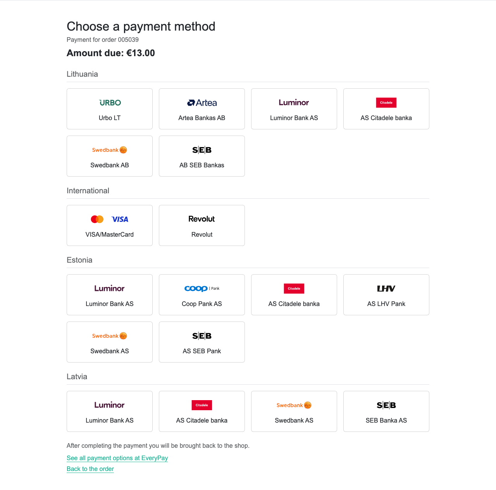
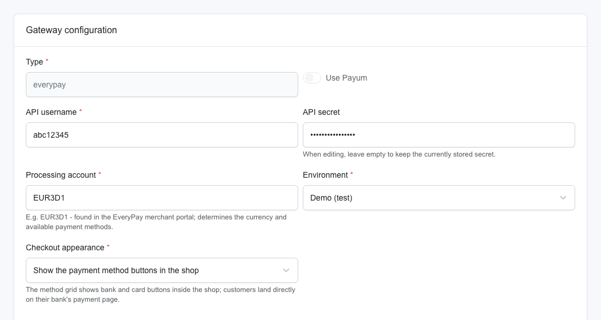
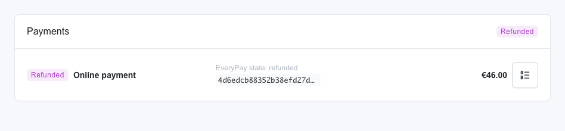

# Sylius EveryPay Plugin

[](https://github.com/pkglt/sylius-everypay-plugin/actions/workflows/build.yaml)
[](https://packagist.org/packages/pkglt/sylius-everypay-plugin)
[](https://packagist.org/packages/pkglt/sylius-everypay-plugin)
[](LICENSE)

[EveryPay](https://every-pay.com) payment gateway for **Sylius 2.x**. EveryPay is the
LHV Paytech e-commerce platform used by the Baltic partner banks **SEB, LHV and
Swedbank** - one integration gives you card payments, Open Banking bank links
(all major Baltic banks), Apple Pay and Google Pay through EveryPay's hosted
payment page.

Built on the modern Sylius **PaymentRequest** pipeline (`sylius/payment-bundle`) -
no legacy Payum. The architecture follows Sylius' official Stripe and PayPal
plugins; see [docs/architecture.md](docs/architecture.md).

EveryPay themselves offer no official Sylius integration and none is planned
(confirmed by EveryPay support, September 2025) - this community plugin fills
that gap.

> Not to be confused with everypay.gr (a Greek PSP with the same name).

## Features

- **One-off payments** via the EveryPay hosted payment page (cards, bank links, wallets)
- **In-shop payment method buttons** (optional): show the bank/card grid with
  EveryPay's own logos directly in your store and send customers straight to
  their bank's payment page - or keep the classic redirect (default)
- **Credential verification on save** - definitively wrong API credentials are
  rejected in the admin form; an unreachable EveryPay never blocks saving
- **Server-to-server callbacks** - unauthenticated callbacks are never trusted;
  the payment state is always re-read from the EveryPay API (the single source of truth)
- **Idempotent state synchronization** - customer return and callbacks may arrive
  in any order, any number of times
- **Full refunds** from the standard Sylius admin Refund button, executed
  transactionally (a failed EveryPay refund never leaves a payment marked refunded)
- **Portal-initiated refund detection** - a refund made in the EveryPay merchant
  portal syncs back without triggering a second refund API call
- **Retry-friendly checkout** - a customer who bounces off the hosted page can
  pay again; failed attempts get a fresh Sylius payment automatically
- **Encrypted credentials** - gateway config is encrypted at rest by Sylius
- Admin form in **English, Lithuanian, Estonian, Latvian**

With the in-shop method buttons enabled, customers pick their bank or card
without leaving the store (methods grouped by country, the customer's own
country first):



## Requirements

| | Version |
|---|---|
| PHP | 8.2+ |
| Sylius | 2.2+ |

Works with the standard Sylius shop frontend out of the box, and with
headless/API-only stores (see [Headless checkouts](#headless--api-checkouts)).

## Installation

### 1. Require the package

```bash
composer require pkglt/sylius-everypay-plugin
```

### 2. Register the bundle

```php
// config/bundles.php
return [
    // ...
    Pkg\SyliusEveryPayPlugin\PkgSyliusEveryPayPlugin::class => ['all' => true],
];
```

### 3. Import the plugin configuration

```yaml
# config/packages/pkg_sylius_everypay.yaml
imports:
    - { resource: '@PkgSyliusEveryPayPlugin/config/config.yaml' }
```

This registers the gateway validation groups and the admin form Twig hooks.
No database migrations are needed - the plugin only uses core Sylius entities
(`sylius_payment`, `sylius_payment_request`, `sylius_gateway_config`).

### 4. Create the payment method

In the Sylius admin: *Payment methods -> Create*, choose the **EveryPay
(cards & bank payments)** gateway, and fill in:

| Field | Where to find it |
|---|---|
| API username / API secret | EveryPay merchant portal -> *Merchant settings -> General* |
| Processing account | e.g. `EUR3D1` - shown in the portal; fixes the currency and available methods |
| Environment | Demo (`igw-demo.every-pay.com`) or Live (`pay.every-pay.eu`) |
| Checkout appearance | Redirect to EveryPay (default), or show the payment method buttons in the shop |



Credentials are verified against the EveryPay API when you save the form -
a wrong secret or an unknown processing account fails validation with a
clear message (network problems never block saving).

Because no Payum factory named `everypay` exists, Sylius automatically stores
`use_payum = 0` on the gateway config and routes checkout through the
PaymentRequest pipeline - no extra configuration needed.

### 5. Set the callback URL in the EveryPay portal

In the merchant portal under *E-shop settings -> Payments*, set the callback
(notification) URL to the Sylius payment method notify endpoint:

```
https://<your-shop-host>/payment-methods/<PAYMENT_METHOD_CODE>
```

Keep **"Additional notifications via callback"** enabled so refund/void/chargeback
events are delivered too, and leave the `order_reference` uniqueness validation
on (the plugin generates unique references per payment attempt).

If your shop sits behind a CDN/WAF (e.g. Cloudflare), make sure
`/payment-methods/*` is neither cached nor bot-challenged - a challenge page
would silently eat the server-to-server callback.

## Headless / API checkouts

With `sylius/shop-bundle` installed, the customer return URL (`customer_url`)
defaults to the shop's `/order/after-pay/{hash}` route - nothing to configure.

In headless stores (or for API-created payment requests in hybrid apps), pass
the return URL of your frontend in the payment request payload instead:

```json
{ "after_pay_url": "https://spa.example/checkout/thank-you" }
```

An explicit `after_pay_url` always wins over the shop route. Remember that
EveryPay rejects URLs with a dotless host (plain `localhost` fails; `*.localhost`
subdomains work). After the customer returns to your frontend, drive the usual
Sylius payment-request status flow to settle the payment.

## How it works

| Flow | Trigger | What happens |
|---|---|---|
| Capture | customer finishes checkout | `POST /v4/payments/oneoff` -> customer is redirected (303) to the hosted payment page |
| Status | customer returns to the shop | payment state re-read from the API, Sylius payment transitioned accordingly |
| Notify | EveryPay server callback | payment resolved by `payment_reference`, state re-read from the API; non-2xx responses make EveryPay redeliver (6 retries / 72 h) |
| Refund | admin presses Refund | refund payment request + `POST /v4/payments/refund` inside one transaction; on API failure everything rolls back and the admin sees an error flash |

Every payment row on the admin order page shows the raw EveryPay state and
the payment reference (and, for live payments, a link to the merchant portal):



See [docs/architecture.md](docs/architecture.md) for the full design
(state mapping table, idempotency and concurrency notes) and
[docs/everypay-api.md](docs/everypay-api.md) for the distilled EveryPay API v4
reference.

## Local development & testing gotchas

- EveryPay rejects `customer_url` with a dotless host - `http://localhost/...`
  fails one-off validation, while `.localhost` subdomains (e.g. `http://myshop.localhost`)
  pass. Point your dev channel hostname at a `.localhost` subdomain.
- Callbacks need a public URL - an `ngrok http 80 --host-header=<your-host>`
  tunnel works fine against the demo environment.
- SEB demo test cards are documented publicly at
  [support.ecommerce.sebgroup.com](https://support.ecommerce.sebgroup.com/en/articles/13459276-test-cards).

## Development

```bash
composer install
vendor/bin/phpunit --testsuite unit         # pure unit tests (no kernel, no DB)
vendor/bin/phpunit --testsuite functional   # boots the plugin inside sylius/test-application
vendor/bin/phpunit                          # both suites
vendor/bin/behat                            # Gherkin payment-lifecycle scenarios
vendor/bin/phpstan analyse                  # static analysis, level 9
vendor/bin/ecs check                        # coding standard (Sylius Labs)
```

The functional suite runs the plugin inside the official Sylius test
application on SQLite with a scripted EveryPay API mock - no database
service, browser or frontend build required. It covers container wiring,
the notify endpoint (including a settled callback moving a payment through
the real state machine), the capture flow on the real payment-request
command bus, and the admin gateway form rendering.

This repository is set up for AI-agent-assisted development - see
[AGENTS.md](AGENTS.md) for the project map, invariants and conventions.

## Roadmap

- Partial refunds via `sylius/refund-plugin` integration
  (the API client already accepts arbitrary amounts)
- Tokenized/CIT payments (`request_token`)
- Embedded in-shop checkout via the EveryPay **Payment Elements** JS SDK - the
  element EveryPay's own platform plugins mount in-page (`mobile_payment`
  one-offs, hosted iframe card form, SAQ A per EveryPay's PCI classification).
  Blocked until EveryPay confirms/documents the SDK for custom integrations -
  see [docs/everypay-api.md](docs/everypay-api.md#payment-elements-embedded-checkout)
- In-shop **Apple Pay / Google Pay buttons** - both wallets already work on the
  hosted payment page with no plugin changes (enable them on the processing
  account); native buttons inside the store ride on the Payment Elements work
  above, or on EveryPay's dedicated wallet web clients
  (`apple-pay-client` / `google-pay-client`), and need Apple Pay merchant
  domain verification through EveryPay

## Contributing & security

Contributions are welcome - see [CONTRIBUTING.md](CONTRIBUTING.md) and the
agent/architecture guide in [AGENTS.md](AGENTS.md). Please report security
issues privately per [SECURITY.md](SECURITY.md). Changes are tracked in the
[CHANGELOG](CHANGELOG.md).

## License

MIT - see [LICENSE](LICENSE).

Verified end-to-end against the EveryPay/SEB demo environment (full pay,
refund, callback and failure paths).

*EveryPay is a trademark of its respective owner (EveryPay AS / LHV Paytech).
This is an independent community integration, not affiliated with or endorsed
by EveryPay, LHV, SEB or Swedbank.*
